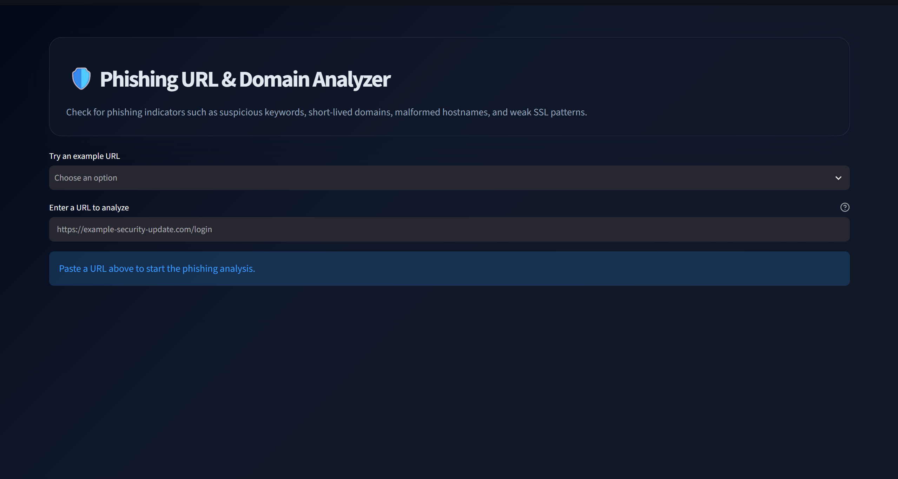
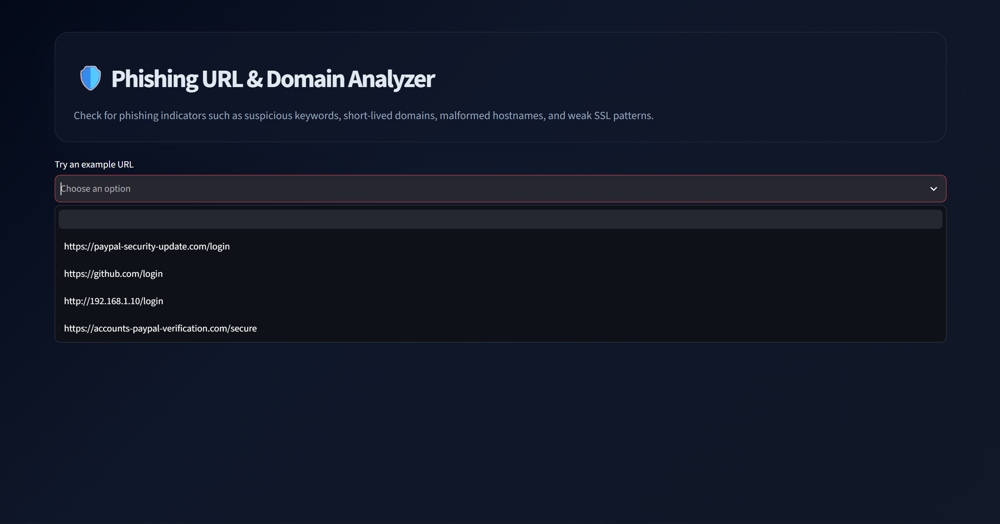

# 🎣 Phishing Domain & URL Detector

A multi-layered threat intelligence tool built with Python and Streamlit that evaluates suspicious URLs and domain names for phishing indicators through real-time lexical inspection, WHOIS registration tracking, and SSL certificate verification.

---

## 📸 Screenshots & Code Showcase

### 1. Application Interface & Risk Scoring

### 2. Code Implementation & Inspection Engine

---

## ✨ Key Features

* **Lexical Anatomy Analysis:** Detects IP-based hostnames, excessive subdomains (`paypal.com.attacker.com`), `@` symbol redirects, and URL length anomalies.
* **WHOIS Domain Age Verification:** Queries domain registration records to flag newly created domains (<30 days old), which account for over 70% of active phishing sites.
* **Credential Harvesting Detection:** Scans URL structures for high-risk targeting keywords (`login`, `verify`, `banking`, `secure`, `update`).
* **SSL/TLS Validation:** Performs socket-level handshakes on port 443 to verify HTTPS availability and certificate issuer authenticity.
* **Weighted Risk Scoring:** Calculates a cumulative 0–100% risk score to classify URLs as **Low Risk 🟢**, **Moderate Risk 🟡**, or **High Risk 🔴**.

---

## 🛠️ Tech Stack

* **Language:** Python 3.10+
* **Frontend Web Framework:** Streamlit
* **Domain & Network Libraries:** `tldextract`, `python-whois`, `socket`, `ssl`
* **Parsing & Logic:** `urllib.parse`, `re`

---

## 🚀 Getting Started

### Prerequisites

* Python 3.8 or higher installed on your machine.

### Installation

1. **Clone the repository:**
   git clone [https://github.com/Miertie/Phishing-Domain-Detector.git]
   cd Phishing-Domain-Detector
2. Install dependencies:
   pip install -r requirements.txt
3. Run the Streamlit application:
   python -m streamlit run main.py